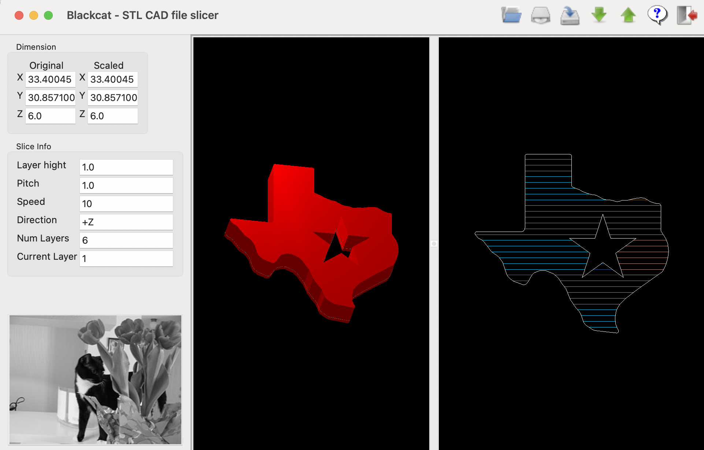

# Blackcat 🐱

**Blackcat** is a lightweight, open-source 3D slicing application for STL CAD models. Originally developed in 2009 and recently modernized for Python 3, it provides a simple yet effective way to visualize 3D models and generate layered toolpaths for manufacturing.



## ✨ Features

- **STL Slicing**: Efficiently slice ASCII STL models into horizontal layers.
- **Dual Visualization**:
  - **3D View**: Interactive 3D model rendering with rotation and lighting.
  - **2D Path View**: Top-down visualization of generated toolpaths (perimeter loops and infill scanlines).
- **Modernized Engine**: Optimized with Python 3.10+ features like `dataclasses`, type hinting, and robust float comparisons.
- **Adjustable Parameters**: Configure layer height, pitch, scale, and slicing direction.
- **Cross-Platform**: Built with **wxPython** and **PyOpenGL** for a consistent experience across Windows, macOS, and Linux.

## 🚀 Installation

### Prerequisites

- **Python 3.10+**
- **wxPython** (Phoenix)
- **PyOpenGL**

### Setup

1. **Clone the repository**:
   ```bash
   git clone https://github.com/skyera/wxblackcat.git
   cd wxblackcat
   ```

2. **Install dependencies**:

   **On Windows/macOS**:
   ```bash
   pip install wxpython pyopengl
   ```

   **On Linux (Ubuntu/Debian)**:
   ```bash
   sudo apt install build-essential libgtk-3-dev libglib2.0-dev libgdk-pixbuf2.0-dev libgl1-mesa-dev libglu1-mesa-dev
   pip install wxpython pyopengl
   ```

## 🛠️ Usage

1. Run the application:
   ```bash
   python blackcat.py
   ```
2. **Open** an STL file from the toolbar.
3. Use the **Slice** tool to configure your parameters (Layer Height, Pitch, etc.).
4. Navigate through layers using the **Next/Prev** buttons or Page Up/Down keys.
5. Save your slicing configuration as an XML file for future reference.

## 📦 Project Structure

- `blackcat.py`: The main GUI application and slicing engine.
- `cat.py`: Helper module for visual assets.
- `data/`: Sample STL files (gears, holes, etc.) for testing.
- `test/`: Unit tests for core slicing logic.

## 📜 License

This project is licensed under the **GNU General Public License v2.0**.

---
*Created by Zhigang Liu (2009). Modernized and maintained by the community.*
